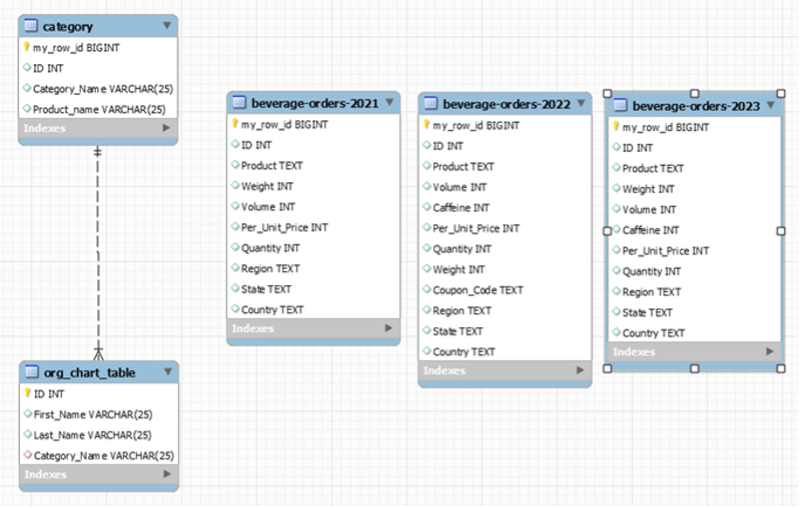
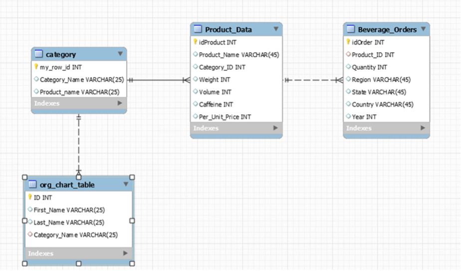

# Beverage Orders ETL Project

##  Project Overview
This project focuses on consolidating beverage order data from multiple years (2021–2023) into a single structured dataset using ETL (Extract, Transform, Load) processes.

##  Objective
- Combine multiple datasets into one unified table
- Clean and standardize data
- Prepare data for analysis and reporting

##  Tools & Technologies
- SQL (MySQL Workbench)
- ETL processes
- Data cleaning and transformation

##  Dataset
- beverage-orders-2021 (72 rows)
- beverage-orders-2022 (187 rows)
- beverage-orders-2023 (102 rows)

## Data Model Entity Relationship Diagrams
### Original Data Structure

### Updated Data Structure

##  ETL Process
1. Extract data from multiple yearly datasets
2. Transform data (cleaning, formatting, standardization)
3. Load into a consolidated table: `consolidated_beverage_data`

##  Results
- Successfully combined datasets into a single table (~361 rows)
- Improved data consistency and structure
- Enabled easier reporting and analysis

##  Key Skills Demonstrated
- SQL querying
- Data transformation
- ETL pipeline design
- Data validation

##  Author
Emmanuel Emedeke

##   Team Contributors
- Jasmine Franklin  
- Dennis Evangelista  
- Frank Gyasi  

##  Academic Context
This project was completed as part of the DATA 635 (Data Management) course in the Master of Science in Data Analytics program at the University of Maryland Global Campus (UMGC).

## My Contribution
- Developed ETL SQL script
- Performed data consolidation
- Validated final dataset

